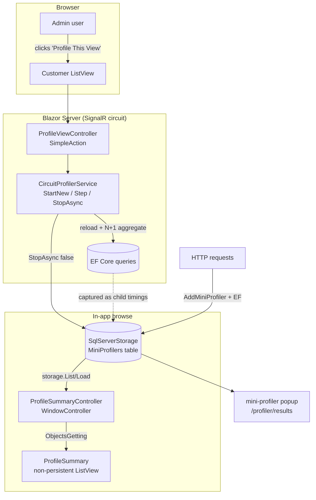

# XAFProfiler

A **DevExpress XAF Blazor Server** proof-of-concept that integrates [StackExchange
MiniProfiler](https://miniprofiler.com/) into an XAF application — cracking the two problems
a typical XAF MiniProfiler integration defers:

1. **Profiling over the Blazor SignalR circuit** (button clicks / grid loads have no
   `HttpContext`, so `MiniProfiler.Current` is null for them).
2. **Persistent storage** of captured profiles (survive app restarts; browsable inside the app).

It is built here in a clean sandbox first, then ported back to a real application.

> **Status (2026-05-31):** Core POC proven. Circuit capture + SQL storage are verified against
> the SQL store (ground truth). The in-app **Profile Summary** browse view renders real data
> (100 rows, GUID cross-checked against the `MiniProfilers` table). See
> [`SESSION_HANDOFF.md`](SESSION_HANDOFF.md) and [`TODO.md`](TODO.md) for the running log.

---

## Architecture at a glance

Three cooperating layers:


*(Editable source: [`docs/architecture.excalidraw`](docs/architecture.excalidraw) — open at
[excalidraw.com](https://excalidraw.com). A Mermaid version is below for inline rendering.)*

| Layer | Concern | Key pieces |
| --- | --- | --- |
| **A — HTTP + EF Core** | Classic per-request profiling + EF SQL capture | `AddMiniProfiler().AddEntityFramework()`, `<mini-profiler />` popup, `Profiling:Enabled` flag, admin-gated authorize |
| **B — Circuit capture** | Profile a real operation over the SignalR circuit | `CircuitProfilerService` (scoped) + a `SimpleAction` ("Profile This View") that manually `StartNew()` / `.Step()` / `StopAsync(false)` |
| **C — Storage + browsing** | Persist profiles + view them in-app | `SqlServerStorage`, `ProfilerStorageInitializer` (bootstraps DB + tables), `ProfileSummary` non-persistent XAF view |



See [`ARCHITECTURE.md`](ARCHITECTURE.md) for the solution layout and
[`docs/HOW_TO_IMPLEMENT.md`](docs/HOW_TO_IMPLEMENT.md) for a step-by-step integration guide
you can follow in your own XAF app.

---

## Tech stack

- **.NET 8**, C# (nullable + implicit usings)
- **DevExpress XAF 25.2.5** (EF Core provider, Blazor Server)
- **EF Core** + **SQL Server** (LocalDB by default: `(localdb)\mssqllocaldb`, catalog `XAFProfiler`)
- **StackExchange MiniProfiler 4.3.8** — `MiniProfiler.AspNetCore.Mvc`,
  `MiniProfiler.EntityFrameworkCore`, `MiniProfiler.Providers.SqlServer`

---

## Quick start

```powershell
# Build (the .slnx solution format needs SDK 10.0.300+; the app itself targets net8.0)
dotnet build XAFProfiler.slnx

# Run
dotnet run --project XAFProfiler/XAFProfiler.Blazor.Server
# → https://localhost:5001   (auto-login as admin / blank password in Development)
```

The demo domain (`Customer → Order → OrderLine`, seeded ~200 / 6k / 33k rows) ships a
deliberately slow `Customer.OrdersTotal` calculated property to produce an obvious **N+1** for
the profiler to capture.

### Try it

1. Open the **Customer** list view → note the `Orders Total` column (the N+1 source).
2. Ribbon → **Tools** → **Profile This View**. A success toast shows the new profile id.
3. Navigation → **Profile Summary** → the captured profiles appear (name, started, duration,
   results URL). This is the in-app browse view that reads straight from `SqlServerStorage`.
4. With `Profiling:Enabled = true`, the MiniProfiler popup also renders for HTTP requests.

### Configuration

| Setting | Where | Default |
| --- | --- | --- |
| `Profiling:Enabled` | `appsettings.json` / `appsettings.Development.json` | `false` / `true` |
| `ConnectionStrings:ConnectionString` | `appsettings.json` | LocalDB, catalog `XAFProfiler` |

Profiling is **off in production by default** and the built-in MiniProfiler UI is admin-gated
(`ResultsAuthorize` / `ResultsListAuthorize`). In Development any authenticated user is allowed.

### Verify profiles in SQL (ground truth)

```powershell
sqlcmd -S "(localdb)\mssqllocaldb" -E -d XAFProfiler -W -Q "SELECT COUNT(*) FROM MiniProfilers"
```

---

## The non-persistent ListView gotcha (read this before reusing the pattern)

The **Profile Summary** view is a non-persistent `[DomainComponent]`. Getting a non-persistent
ListView to actually show data in **XAF Blazor** requires **three things together** — miss any
one and the grid silently shows "No data to display":

1. **`DataAccessMode=Client`** on the ListView (`Model.xafml`). Blazor defaults to **Queryable**,
   which never raises `ObjectsGetting` for a type with no data store.
2. A **`DevExpress.ExpressApp.Data.Key`** on the key property — *not* the EF Core
   `System.ComponentModel.DataAnnotations.Key`, which XAF's non-persistent key detection ignores.
3. Subscribe `ObjectsGetting` / `ObjectByKeyGetting` via **`XafApplication.ObjectSpaceCreated`
   from a `WindowController`** — *not* a per-view `ViewController.OnActivated`. The collection
   source requests objects during view creation, *before* per-view controllers activate, so an
   `OnActivated` subscription is always too late.

Full write-up and the relevant DevExpress docs links are in
[`docs/HOW_TO_IMPLEMENT.md`](docs/HOW_TO_IMPLEMENT.md#step-6--browse-profiles-in-app-non-persistent-listview).

---

## Repository layout

```
XAFProfiler/
├── XAFProfiler.slnx                         ← solution (build this)
├── README.md  ARCHITECTURE.md  TODO.md  SESSION_HANDOFF.md
├── docs/
│   ├── HOW_TO_IMPLEMENT.md                  ← step-by-step integration guide
│   ├── architecture.excalidraw              ← editable diagram (open at excalidraw.com)
│   └── plans/                               ← original design + implementation plans
└── XAFProfiler/
    ├── XAFProfiler.Module/                  ← shared module (demo domain, DbContext, seed)
    └── XAFProfiler.Blazor.Server/           ← host app
        ├── Startup.cs                       ← MiniProfiler + XAF registration, pipeline
        ├── Services/CircuitProfilerService.cs
        ├── Services/ProfilerStorageInitializer.cs
        ├── Controllers/ProfileViewController.cs
        ├── Controllers/ProfileSummaryController.cs
        ├── BusinessObjects/ProfileSummary.cs
        └── Model.xafml                      ← ProfileSummary_ListView DataAccessMode=Client
```

---

## License / status

Internal proof-of-concept. Not production-hardened — see the "code-review items" in
[`SESSION_HANDOFF.md`](SESSION_HANDOFF.md) (sync-over-async stop, null connection-string guard,
swap `Console.WriteLine` diagnostics for `ILogger`) before shipping the pattern.
