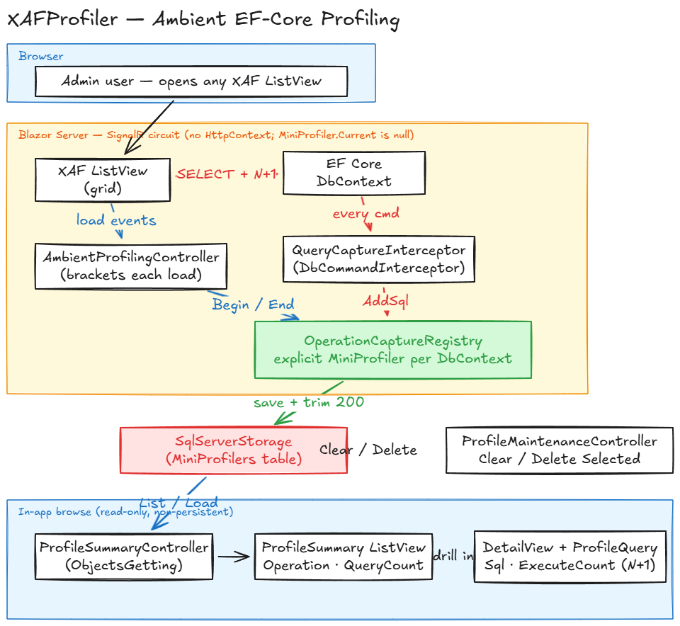
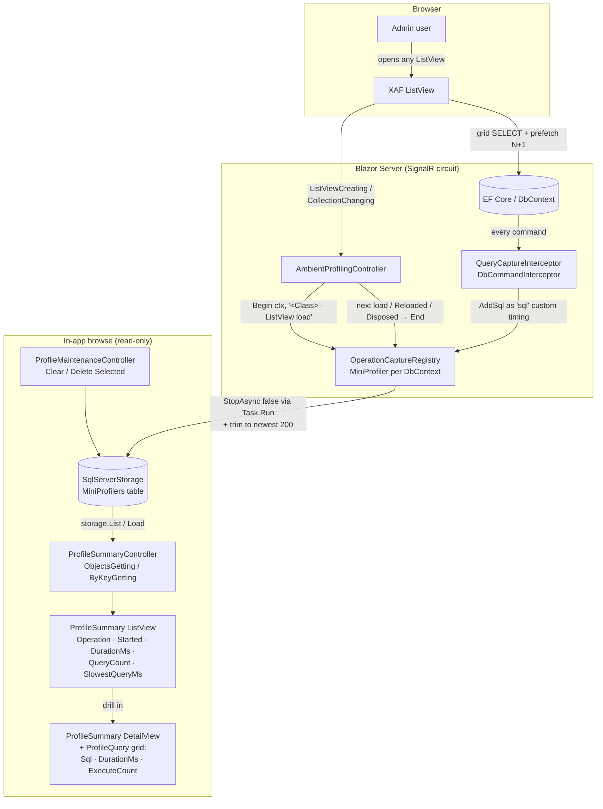

# XAFProfiler

A **DevExpress XAF Blazor Server** proof-of-concept that integrates [StackExchange
MiniProfiler](https://miniprofiler.com/) into an XAF application — cracking the two problems
a typical XAF MiniProfiler integration defers:

1. **Profiling over the Blazor SignalR circuit** (grid loads / button clicks have no
   `HttpContext`, so `MiniProfiler.Current` is null for them — and even MiniProfiler's own EF
   interceptor, which logs to that `AsyncLocal`, captures nothing for the grid).
2. **Persistent storage** of captured profiles (survive app restarts; browsable inside the app).

It is built here in a clean sandbox first, then ported back to a real application (WLNCentral).

> **Status (2026-05-31):** **Ambient EF-Core profiling** is built, verified end-to-end against
> the SQL store, and merged to `master` (pushed to `origin`). Every XAF ListView data-load is
> captured **automatically** — there is no button to click. A `Customer · ListView load` captures
> ~1,125 SQL commands; the read-only drill-down DetailView surfaces the N+1
> (`SELECT … FROM [OrderLines]`, `ExecuteCount` ≈ 1,089). Build: `dotnet build XAFProfiler.slnx`
> → 0 warnings / 0 errors. See [`SESSION_HANDOFF.md`](SESSION_HANDOFF.md) and [`TODO.md`](TODO.md)
> for the running log.

---

## How it works (ambient capture)

The earlier POC had a manual **"Profile This View"** action. That has been **removed** and
replaced by **automatic, app-wide EF-Core capture**: you just use the app, then open **Profile
Summary** to see what every screen actually ran.

The core trick is that the DevExpress grid materialises its query on an async chain where
`MiniProfiler.Current` (an `AsyncLocal`) is `null`, so MiniProfiler's built-in EF interceptor
never sees the grid's SQL. Instead we hold a `MiniProfiler` **explicitly** per in-flight
operation and attribute captured SQL by **`DbContext` instance**:



*(Editable source: [`docs/architecture.excalidraw`](docs/architecture.excalidraw) — open at
[excalidraw.com](https://excalidraw.com). The same flow is rendered as Mermaid below.)*

| Piece | Role |
| --- | --- |
| `AmbientProfilingController` (Main `WindowController`) | Brackets each ListView load. On `CollectionChanging`/`Reloading` it `Begin`s an operation for the view's `DbContext`; it flushes (`End` → stop + save) when the next load begins, on `Reloaded`, on `Disposed`, or on deactivation. |
| `OperationCaptureRegistry` (singleton) | Holds one explicitly-started `MiniProfiler` per active operation, keyed by `DbContext` in a `ConditionalWeakTable`. `End` stops+saves via a **mandatory `Task.Run(...).GetAwaiter().GetResult()`** offload (a direct sync-over-async deadlocks on the circuit's `RendererSynchronizationContext`) and trims storage to the newest 200. |
| `QueryCaptureInterceptor` (singleton `DbCommandInterceptor`) | Registered on the XAF `DbContext` via `AddInterceptors`. On every executed command it looks up that `DbContext`'s active operation and appends the SQL as a `"sql"` custom timing — **never** touching `MiniProfiler.Current`. |
| `SqlServerStorage` + `ProfilerStorageInitializer` | Persist profiles to SQL Server (same connection string XAF uses); bootstrap the DB + the three MiniProfiler tables at startup. |
| `ProfileSummary` / `ProfileQuery` + their controllers | A read-only, identifiable, **drillable** browse surface (operation name, started, duration, query count, slowest query → per-query SQL with `ExecuteCount` = the N+1 signal), plus **Clear Profiles** / **Delete Selected** maintenance. |



See [`ARCHITECTURE.md`](ARCHITECTURE.md) for the solution layout and
[`docs/HOW_TO_IMPLEMENT.md`](docs/HOW_TO_IMPLEMENT.md) for a step-by-step integration guide
you can follow in your own XAF app.

---

## Tech stack

- **.NET 8**, C# (nullable + implicit usings)
- **DevExpress XAF 25.2.5** (EF Core provider, Blazor Server)
- **EF Core** + **SQL Server** (LocalDB by default: `(localdb)\mssqllocaldb`, catalog `XAFProfiler`)
- **StackExchange MiniProfiler 4.3.8** — `MiniProfiler.AspNetCore.Mvc`,
  `MiniProfiler.EntityFrameworkCore`, `MiniProfiler.Providers.SqlServer`

---

## Quick start

```powershell
# Build (the .slnx solution format needs SDK 10.0.300+; the app itself targets net8.0)
dotnet build XAFProfiler.slnx

# Run
dotnet run --project XAFProfiler/XAFProfiler.Blazor.Server
# → https://localhost:5001   (auto-login as admin / blank password in Development)
```

The demo domain (`Customer → Order → OrderLine`, seeded **200 / ~6k / ~33k** rows) ships a
deliberately slow `Customer.OrdersTotal` calculated property to produce an obvious **N+1** for
the profiler to capture.

### Try it (no button — it's automatic)

1. Open the **Customer** list view → note the `Orders Total` column (the N+1 source). Just
   loading this view is captured automatically.
2. Navigate to **another view** (e.g. open Profile Summary). Navigating *away* is what flushes
   the previous load's captured profile to storage — see the note below.
3. Navigation → **Profile Summary** → the captured operations appear, each named like
   `Customer · ListView load`, with **QueryCount** and **SlowestQueryMs**.
4. **Double-click** a row → the read-only DetailView opens with the **per-query** grid
   (`Sql · DurationMs · ExecuteCount`). The N+1 shows up as an `OrderLines` SELECT with a high
   `ExecuteCount`.
5. **Clear Profiles** / **Delete Selected** (Tools) empty the store when you want a clean slate.

> **Why navigate away?** A load's SQL runs synchronously right after the grid's
> `CollectionChanged`, but XAF keeps the previous view alive (its collection source's `Disposed`
> doesn't fire on navigation). So a load is flushed to storage when the **next** load begins. The
> currently-open view's own profile isn't saved until you navigate elsewhere — intrinsic to the
> no-`Disposed`-on-nav model, and acceptable for this POC.

### Configuration

| Setting | Where | Default |
| --- | --- | --- |
| `Profiling:Enabled` | `appsettings.json` / `appsettings.Development.json` | `false` / `true` |
| `ConnectionStrings:ConnectionString` | `appsettings.json` | LocalDB, catalog `XAFProfiler` |

Profiling is **off in production by default**. When off, the interceptor, registry, and capture
controller are never wired up (zero overhead) and the built-in MiniProfiler middleware isn't
registered. HTTP-request auto-profiling is disabled even when on (`ShouldProfile = _ => false`),
so the only rows persisted are the named ambient operations — no `/_blazor` / `/_Host` noise.

### Verify profiles in SQL (ground truth)

```powershell
sqlcmd -S "(localdb)\mssqllocaldb" -E -d XAFProfiler -W -Q "SELECT COUNT(*) FROM MiniProfilers"
```

---

## The non-persistent ListView gotcha (read this before reusing the pattern)

**Profile Summary** and its nested **Queries** grid are non-persistent `[DomainComponent]`
objects. Getting a non-persistent ListView to actually show data in **XAF Blazor** requires
**three things together** — miss any one and the grid silently shows "No data to display":

1. **`DataAccessMode=Client`** on the ListView (`Model.xafml`). Blazor defaults to **Queryable**,
   which never raises `ObjectsGetting` for a type with no data store.
2. A **`DevExpress.ExpressApp.Data.Key`** on the key property — *not* the EF Core
   `System.ComponentModel.DataAnnotations.Key`, which XAF's non-persistent key detection ignores.
3. Subscribe `ObjectsGetting` / `ObjectByKeyGetting` via **`XafApplication.ObjectSpaceCreated`
   from a `WindowController`** — *not* a per-view `ViewController.OnActivated`. The collection
   source requests objects during view creation, *before* per-view controllers activate, so an
   `OnActivated` subscription is always too late.

Two further gotchas the drill-down surfaced:

- **Error 1057** when double-clicking a row — `CreateObject<T>()` marks the projection as a *new*
  object, and XAF refuses to open a DetailView for an unsaved new object. Fix: call
  `npos.RemoveFromModifiedObjects(obj)` so it's treated as existing/unchanged.
- **Empty nested grid on the DetailView** — opening a DetailView from a ListView **reuses** the
  list row's object (whose `Queries` collection was left empty for speed), it does *not* re-fetch
  via `ObjectByKeyGetting`. Fix: a DetailView controller lazily populates `Queries` on activation.

Full write-up and the relevant DevExpress docs links are in
[`docs/HOW_TO_IMPLEMENT.md`](docs/HOW_TO_IMPLEMENT.md#step-7--browse--drill-into-profiles-non-persistent-listview).

---

## Repository layout

```
XAFProfiler/
├── XAFProfiler.slnx                         ← solution (build this)
├── README.md  ARCHITECTURE.md  TODO.md  SESSION_HANDOFF.md
├── docs/
│   ├── HOW_TO_IMPLEMENT.md                  ← step-by-step integration guide
│   ├── architecture.excalidraw / .png       ← ambient-flow diagram (editable + rendered)
│   └── plans/                               ← design + implementation plans
│       ├── 2026-05-30-miniprofiler-poc-*.md         (original 3-layer POC)
│       └── 2026-05-31-ambient-ef-profiling*.md      (the ambient pivot — current)
└── XAFProfiler/
    ├── XAFProfiler.Module/                  ← shared module (demo domain, DbContext, seed)
    └── XAFProfiler.Blazor.Server/           ← host app
        ├── Startup.cs                       ← MiniProfiler + XAF registration, interceptor wiring
        ├── Services/
        │   ├── QueryCaptureInterceptor.cs   ← DbCommandInterceptor (captures SQL)
        │   ├── OperationCaptureRegistry.cs  ← explicit MiniProfiler per DbContext + retention
        │   ├── ProfileProjection.cs         ← MiniProfiler timing tree → ProfileSummary/ProfileQuery
        │   ├── ProfileStore.cs              ← direct-SQL Clear / Delete / Trim
        │   ├── ProfilerStorageInitializer.cs← bootstrap DB + MiniProfiler tables
        │   └── ProfilingConstants.cs        ← shared "sql" custom-timing key
        ├── Controllers/
        │   ├── AmbientProfilingController.cs ← brackets each ListView load (capture driver)
        │   ├── ProfileSummaryController.cs   ← populates the browse ListView
        │   ├── ProfileSummaryDetailController.cs ← populates the drill-down Queries grid
        │   └── ProfileMaintenanceController.cs    ← Clear / Delete Selected actions
        ├── BusinessObjects/ProfileSummary.cs + ProfileQuery.cs
        └── Model.xafml                      ← Client mode + read-only for the profiler views
```

---

## License / status

Internal proof-of-concept. Not production-hardened — see the "code-review items" in
[`SESSION_HANDOFF.md`](SESSION_HANDOFF.md) (null connection-string guard in
`ProfilerStorageInitializer`; swap the remaining `Console.WriteLine` diagnostics there for
`ILogger`; retention trim is fire-and-forget on every load) before shipping the pattern.
